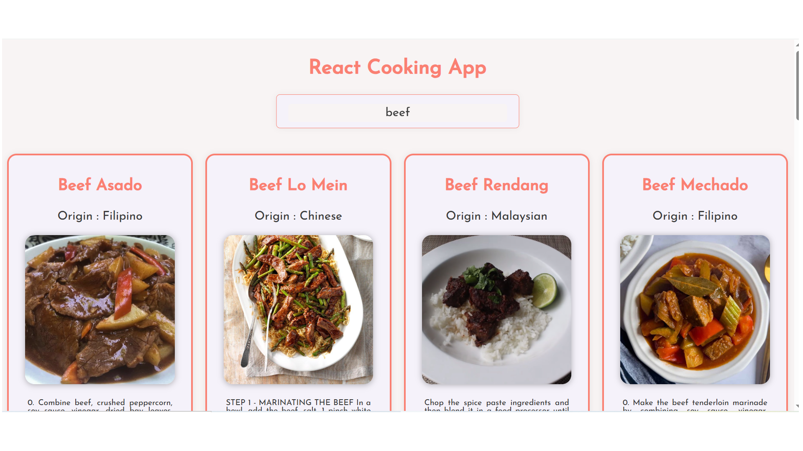

# Cooking App 🍳

Une application web moderne pour découvrir et explorer des recettes de cuisine.

## 📝 Description

Cooking App est une application React qui permet aux utilisateurs de rechercher et découvrir des recettes de cuisine. L'application offre une interface utilisateur intuitive et responsive pour une expérience de recherche de recettes agréable.

## ✨ Fonctionnalités

- 🔍 Recherche de recettes
- 🎯 Affichage des résultats sous forme de cartes (à partir d'une API)
- 📱 Interface responsive
- ⚡ Chargement dynamique des données

## 🛠️ Technologies utilisées

- React.js
- React Router DOM
- Axios pour les requêtes HTTP
- CSS moderne pour le style

## 🚀 Installation

1. Clonez le repository :

```bash
git clone git@github.com:ProjetsDevFanny/cooking-app.git
```

2. Installez les dépendances :

```bash
cd cooking-app
npm install
```

3. Lancez l'application :

```bash
npm start
```

L'application sera accessible à l'adresse `http://localhost:3000`

## 📸 Screenshots



## 🎥 Démo

https://cooking-app-fanny.netlify.app/

## 📁 Structure du projet

```
cooking-app/
├── src/
│   ├── components/     # Composants réutilisables
│   ├── pages/         # Pages de l'application
│   ├── styles/        # Fichiers CSS
│   ├── assets/        # Images et autres ressources
│   ├── App.js         # Composant principal
│   └── index.js       # Point d'entrée
├── public/            # Fichiers statiques
└── package.json       # Dépendances et scripts
```

## 🤝 Contribution

Les contributions sont les bienvenues ! N'hésitez pas à ouvrir une issue ou à soumettre une pull request.

## 📄 Licence

Ce projet est sous licence MIT.

## 👤 Auteur

Fanny

---

N'hésitez pas à me contacter pour toute question ou suggestion !
